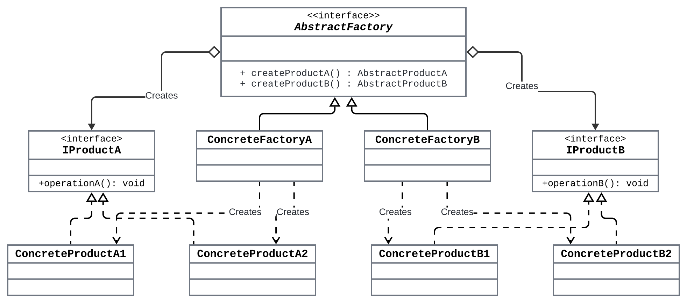

# **Title: The Abstract Factory Pattern: One Factory Isn’t Enough? Let’s Build a Factory of Factories!**

> **Description**: Take your design skills to the next level with the Abstract Factory Pattern. Learn how it helps you create families of related objects and build scalable, maintainable systems with ease.

---

## [Previously in the World of Design Patterns…](factory_design_pattern)

Let’s return to the coffee shop analogy, but this time, you’re ordering a whole meal, not just a latte. Depending on whether you’re in the mood for breakfast, lunch, or dinner, the barista prepares a whole set of items—coffee, pastry, and juice, all tailored to the meal type. This is the essence of the **Abstract Factory Pattern**: instead of creating one object, it’s used to create **families of related objects** that work together.

> **Formal Definition**: The Abstract Factory Pattern helps create an **entire set of related objects**, like a UI that includes both buttons and checkboxes, ensuring all components follow the same platform-specific look and feel.

---

# Abstract Factory Pattern: When a Factory Needs to Build More Than One Thing

The **Abstract Factory Pattern** is like the Factory Pattern on steroids. Instead of creating individual objects, the Abstract Factory builds **families of related objects** without specifying their concrete classes. Imagine a super factory—one that builds entire sets of related items, like buttons, checkboxes, or window elements, depending on the environment (Windows, Mac, etc.).

> **Analogy Time**: If the Factory Pattern is a barista that makes one specific coffee for you (like an espresso), the Abstract Factory is a full-blown coffee shop where you don’t just get coffee—you get a matching set of a coffee, a pastry, and maybe even a nice reusable cup, all tailored to your order.

---

# Why Abstract Factory?
Think of it like this: with the Factory Pattern, you’re focused on creating **one object** at a time. But what if you need several related objects that all need to work together, like building an entire user interface for different platforms? That’s when the **Abstract Factory Pattern** comes in handy.

1. **Creates Families of Related Objects**: The Abstract Factory produces related objects that belong to a specific group (e.g., all Mac UI elements or all Windows UI elements).
2. **Decouples Object Creation from Implementation**: Like the Factory Pattern, it separates the creation of objects from their concrete classes, allowing flexibility.
3. **Platform Independence**: Useful for building cross-platform applications where families of related objects need to be created for different environments (e.g., different UI components for different OSes).

---

# **Factory vs. Abstract Factory: What's the Difference?**

Before we dive into code, let’s clarify the main differences between the **Factory Pattern** and **Abstract Factory Pattern**. Both patterns help you create objects, but the scope of what they build is different.

- **Factory Pattern**: Focuses on creating a **single object**.
  - Example: A factory that creates a **button** (Windows or Mac).
  
- **Abstract Factory Pattern**: Focuses on creating a **family of related objects**.
  - Example: An abstract factory that creates an entire **UI set**—button, checkbox, and scrollbar—tailored for either Windows or Mac.

> **Key Point**: The Abstract Factory doesn’t just build one thing—it builds a **suite** of things, making it ideal when you need consistency across related objects.

---

Your introduction of the **Factory Design Pattern's structure and class diagram** is clean and concise. I'll keep the same style for the **Abstract Factory Design Pattern** while explaining its components and how they interact, following the same flow you provided.

---

# Key Components of the Abstract Factory Design Pattern


1. **Abstract Products (Interfaces or Abstract Classes):**
   - These are interfaces or abstract classes that define the common methods that the product families must implement. 
   - In the diagram, `AbstractProductA` and `AbstractProductB` represent abstract products, such as **Button** and **Checkbox** in a GUI application.
   - These abstract products define the operations that all variants of the product must implement (e.g., `operationA()` for `AbstractProductA`).

2. **Concrete Products (Subclasses):**
   - Concrete implementations of the abstract products, representing specific variants for different families.
   - In the diagram, `ConcreteProductA1`, `ConcreteProductA2`, `ConcreteProductB1`, and `ConcreteProductB2` are concrete products, such as `WindowsButton`, `MacButton`, `WindowsCheckbox`, and `MacCheckbox`.
   - Each concrete product implements the methods defined by its respective abstract product.

3. **Abstract Factory (Interface or Abstract Class):**
   - This is the central interface that declares methods for creating abstract products.
   - In the diagram, the `AbstractFactory` declares methods like `createProductA()` and `createProductB()` to create different types of abstract products.
   - For a GUI system, this factory could be something like `GUIFactory`, with methods like `createButton()` and `createCheckbox()`.

4. **Concrete Factories (Subclasses of Abstract Factory):**
   - Concrete factories implement the abstract factory interface and are responsible for creating the concrete products that belong to a particular family or variant.
   - In the diagram, `ConcreteFactory1` and `ConcreteFactory2` represent concrete factories like `WindowsFactory` and `MacFactory`, which are responsible for creating specific platform-specific products.
   - These factories return the appropriate concrete product (e.g., `WindowsButton`, `WindowsCheckbox` for `WindowsFactory`).

### Class Diagram



### How the Components Interact
1. **Client Code:**
   - The client interacts only with the **AbstractFactory** and **Abstract Products**, without knowing the exact concrete factory or products being used.
   - The client calls methods from the abstract factory (e.g., `createProductA()`, `createProductB()`), which returns abstract products. These abstract products are then used by the client, providing loose coupling between the client code and the actual product creation.

2. **Abstract Factory’s Methods:**
   - The `AbstractFactory` defines methods for creating abstract products (e.g., `createProductA()`, `createProductB()`).
   - These methods act as placeholders, which will be overridden by the concrete factories to create actual product instances.

3. **Concrete Factory’s Methods:**
   - Each **ConcreteFactory** (e.g., `ConcreteFactory1`, `ConcreteFactory2`) implements the abstract factory's methods and is responsible for returning the appropriate **ConcreteProduct** (e.g., `ConcreteProductA1`, `ConcreteProductB1` for `ConcreteFactory1`).
   - The concrete factories ensure that the correct family of related objects is created and returned to the client, without the client knowing the specifics.

4. **Abstract Products and Concrete Products:**
   - The **Abstract Products** (`AbstractProductA`, `AbstractProductB`) declare the operations that all product variants must implement.
   - The **Concrete Products** (`ConcreteProductA1`, `ConcreteProductB1`, `ConcreteProductA2`, `ConcreteProductB2`) implement these operations, allowing the client to use the products without being concerned about the concrete class.
   - For example, a client requesting a `Button` (abstract product) will get a `WindowsButton` or `MacButton` depending on which factory was used.


### Comparison to Factory Design Pattern

- In the **Factory Design Pattern**, the focus is on creating a **single object** from a family of products.
- In the **Abstract Factory Design Pattern**, the focus is on creating **families of related objects** (multiple objects) that belong together, ensuring consistency in their interactions.


---
# Scenario and Python Implementation

## Example 1: Vehicle Fleet Creation
Imagine you’re developing a **vehicle fleet management system** for a transportation company. The company needs different types of vehicles for different purposes, such as **Passenger Vehicles** and **Cargo Vehicles**. Each type of vehicle comes with specific subtypes, such as **Car**, **Bus**, or **Truck**. The system should be flexible enough to generate entire families of related vehicles (for both passenger and cargo purposes), depending on the company’s needs.

### Problem
You need a way to create entire **families of related vehicles** (e.g., passenger vehicles or cargo vehicles) without directly coupling the client code to specific vehicle types. The system should be flexible enough to support new vehicle categories or types without changing existing code.

### Solution
The **Abstract Factory Pattern** allows you to create families of related vehicles, such as all passenger vehicles (Car, Bus) or all cargo vehicles (Truck, Van). Each type of vehicle belongs to a related family, and the abstract factory allows the client to generate an entire family of vehicles without knowing the concrete details of each type.

### Python Code

```python
from abc import ABC, abstractmethod

# Step 1: Abstract products
class PassengerVehicle(ABC):
    """Abstract product class for passenger vehicles."""
    
    @abstractmethod
    def create(self) -> str:
        pass

class CargoVehicle(ABC):
    """Abstract product class for cargo vehicles."""
    
    @abstractmethod
    def create(self) -> str:
        pass

# Step 2: Concrete products for Passenger Vehicles
class Car(PassengerVehicle):
    def create(self) -> str:
        return "Passenger Car Created"

class Bus(PassengerVehicle):
    def create(self) -> str:
        return "Passenger Bus Created"

# Step 3: Concrete products for Cargo Vehicles
class Truck(CargoVehicle):
    def create(self) -> str:
        return "Cargo Truck Created"

class Van(CargoVehicle):
    def create(self) -> str:
        return "Cargo Van Created"

# Step 4: Abstract factory class
class VehicleFactory(ABC):
    """Abstract factory to create families of vehicles."""
    
    @abstractmethod
    def create_passenger_vehicle(self) -> PassengerVehicle:
        pass

    @abstractmethod
    def create_cargo_vehicle(self) -> CargoVehicle:
        pass

# Step 5: Concrete factories for Passenger and Cargo Vehicles
class PassengerVehicleFactory(VehicleFactory):
    def create_passenger_vehicle(self) -> PassengerVehicle:
        return Car()

    def create_cargo_vehicle(self) -> CargoVehicle:
        return Van()

class CargoVehicleFactory(VehicleFactory):
    def create_passenger_vehicle(self) -> PassengerVehicle:
        return Bus()

    def create_cargo_vehicle(self) -> CargoVehicle:
        return Truck()

# Step 6: Client code
def get_factory(factory_type: str) -> VehicleFactory:
    if factory_type == "passenger":
        return PassengerVehicleFactory()
    elif factory_type == "cargo":
        return CargoVehicleFactory()
    else:
        raise ValueError(f"Unknown factory type: {factory_type}")

# Usage
factory = get_factory("cargo")
passenger_vehicle = factory.create_passenger_vehicle()
cargo_vehicle = factory.create_cargo_vehicle()

print(passenger_vehicle.create())  # Output: Passenger Bus Created
print(cargo_vehicle.create())      # Output: Cargo Truck Created
```

### Explanation

- **PassengerVehicle and CargoVehicle (Abstract Base Classes):**
  - Define the `create` method that all specific types of vehicles (passenger and cargo) must implement.
  - Act as the **Product** interfaces for the Abstract Factory Pattern, representing the two families of related products (passenger vehicles and cargo vehicles).

- **Car, Bus (Passenger Vehicles) and Truck, Van (Cargo Vehicles) (Concrete Products):**
  - Each class implements the `create` method, returning a message indicating the creation of the vehicle (e.g., `"Passenger Car Created"` or `"Cargo Truck Created"`).
  - Represent specific types of passenger or cargo vehicles that the company needs.

- **VehicleFactory (Abstract Factory Class):**
  - Provides an interface to create families of related vehicles (both passenger and cargo vehicles).
  - Defines two abstract methods, `create_passenger_vehicle` and `create_cargo_vehicle`, that the concrete factories must implement.

- **PassengerVehicleFactory and CargoVehicleFactory (Concrete Factories):**
  - Implement the methods defined in `VehicleFactory` to create the correct types of vehicles based on whether the client needs a passenger or cargo vehicle.
  - `PassengerVehicleFactory` creates a `Car` for passengers and a `Van` for cargo, while `CargoVehicleFactory` creates a `Bus` for passengers and a `Truck` for cargo.

- **Client Code:**
  - Calls `get_factory` to obtain a factory based on the client’s needs (passenger or cargo vehicles) without worrying about how these vehicle families are created.
  - Uses the factory to create both passenger and cargo vehicles, ensuring consistency in the vehicle family.
  - This approach makes the system flexible and scalable, allowing new vehicle families to be added without changing the core logic.

## Example 2: Cross-Platform UI Components
In addition to buttons, your **cross-platform GUI application** now requires other UI components, such as **checkboxes**. Each platform has its own distinct look and feel for these components, and you want your code to remain clean, maintainable, and easily extendable when supporting new platforms. Instantiating platform-specific buttons and checkboxes directly across your code would lead to redundancy and complexity.

### Problem
Directly creating platform-specific components like `WindowsButton` and `MacCheckbox` in the code leads to **tight coupling** and **code duplication**, making it difficult to maintain and scale the system. If a new platform or UI component is introduced, multiple code modifications are required, leading to reduced flexibility.

### Solution
The **Abstract Factory Pattern** allows you to create families of related UI components (such as buttons and checkboxes) for different platforms. The client code can request a button and checkbox from the appropriate factory based on the platform, without knowing the specific details of how each component is created. This keeps the creation logic centralized and flexible for future extensions.

### Python Code

```python
from abc import ABC, abstractmethod
import platform

# Abstract Product Classes
class Button(ABC):
    """Abstract Button class defining the render method for buttons."""
    
    @abstractmethod
    def render(self) -> str:
        """Renders the button."""
        pass


class Checkbox(ABC):
    """Abstract Checkbox class defining the render method for checkboxes."""
    
    @abstractmethod
    def render(self) -> str:
        """Renders the checkbox."""
        pass


# Concrete Product Classes for Windows
class WindowsButton(Button):
    """Button implementation for Windows platform."""
    
    def render(self) -> str:
        """Render a Windows-style button."""
        return "Rendering a Windows-style button."


class WindowsCheckbox(Checkbox):
    """Checkbox implementation for Windows platform."""
    
    def render(self) -> str:
        """Render a Windows-style checkbox."""
        return "Rendering a Windows-style checkbox."


# Concrete Product Classes for macOS
class MacButton(Button):
    """Button implementation for macOS platform."""
    
    def render(self) -> str:
        """Render a macOS-style button."""
        return "Rendering a macOS-style button."


class MacCheckbox(Checkbox):
    """Checkbox implementation for macOS platform."""
    
    def render(self) -> str:
        """Render a macOS-style checkbox."""
        return "Rendering a macOS-style checkbox."


# Abstract Factory Class
class GUIFactory(ABC):
    """Abstract Factory class defining methods to create related GUI components."""
    
    @abstractmethod
    def create_button(self) -> Button:
        """Creates a button object."""
        pass

    @abstractmethod
    def create_checkbox(self) -> Checkbox:
        """Creates a checkbox object."""
        pass


# Concrete Factory Classes
class WindowsFactory(GUIFactory):
    """Factory to create Windows-specific GUI components."""
    
    def create_button(self) -> Button:
        """Creates a Windows-style button."""
        return WindowsButton()

    def create_checkbox(self) -> Checkbox:
        """Creates a Windows-style checkbox."""
        return WindowsCheckbox()


class MacFactory(GUIFactory):
    """Factory to create macOS-specific GUI components."""
    
    def create_button(self) -> Button:
        """Creates a macOS-style button."""
        return MacButton()

    def create_checkbox(self) -> Checkbox:
        """Creates a macOS-style checkbox."""
        return MacCheckbox()


# Client Code
def get_gui_factory() -> GUIFactory:
    """
    Returns the appropriate GUIFactory based on the current operating system.
    
    Returns:
        GUIFactory: A factory to create platform-specific GUI components.
    Raises:
        ValueError: If the operating system is unsupported.
    """
    os_name: str = platform.system()
    if os_name == "Windows":
        return WindowsFactory()
    elif os_name == "Darwin":  # macOS is identified as 'Darwin'
        return MacFactory()
    else:
        raise ValueError(f"Unsupported OS: {os_name}")


# Usage
factory: GUIFactory = get_gui_factory()
button: Button = factory.create_button()
checkbox: Checkbox = factory.create_checkbox()

print(button.render())    # Output depends on the platform
print(checkbox.render())  # Output depends on the platform
```

### Explanation
- **Button and Checkbox (Abstract Base Classes):**
  - Define the `render` method that all buttons and checkboxes must implement.
  - Act as the **Product** interfaces in the Abstract Factory Pattern, representing the families of related products (buttons and checkboxes).

- **WindowsButton, WindowsCheckbox, MacButton, MacCheckbox (Concrete Products):**
  - Each class implements the `render` method to return a message indicating the platform-specific rendering of the button or checkbox.
  - Represent the different types of buttons and checkboxes required for both **Windows** and **macOS** platforms, ensuring the GUI components are consistent with the native style of the OS.

- **GUIFactory (Abstract Factory Class):**
  - Provides an interface to create families of related products (buttons and checkboxes).
  - Defines two abstract methods: `create_button` and `create_checkbox`, which the concrete factories must implement.

- **WindowsFactory and MacFactory (Concrete Factories):**
  - Implement the methods defined in `GUIFactory` to create the correct platform-specific products (buttons and checkboxes).
  - `WindowsFactory` creates a `WindowsButton` and a `WindowsCheckbox`, while `MacFactory` creates a `MacButton` and a `MacCheckbox`.

- **Client Code:**
  - Calls `get_gui_factory` to obtain a factory based on the operating system, without needing to know the specifics of how the components are created for each platform.
  - Uses the factory to create both a button and a checkbox that match the platform, ensuring consistency across the UI.
  - This approach allows for future scalability, as new platforms can be supported by simply adding new factories without changing the client code.


## Example 3: Abstract Factory for Animal Kingdom

Imagine you’re working on a zoo simulation where animals behave differently based on their habitat. The simulation needs to generate different types of animals—Herbivores and Carnivores—for different habitats like **Forest** and **Savanna**. Each habitat has its own set of animals that follow specific behaviors (e.g., a Deer grazes in the forest, while a Lion hunts in the savanna). You want a flexible way to generate these animals while keeping the simulation code simple and adaptable to new habitats.

### Problem
How can you create animals that fit different environments without hardcoding the animal creation logic for each habitat?
The goal is to ensure that the correct combination of Herbivores and Carnivores is generated for each habitat while making it easy to introduce new animals or habitats.
### Solution
Using the Abstract Factory Pattern, you can create families of related animals for each habitat. The client code doesn’t need to know the specific type of animal; it simply interacts with abstract products (Herbivore and Carnivore), and each concrete factory (ForestFactory or SavannaFactory) ensures that the right animals are created based on the habitat.
The pattern allows for easy extension—if a new habitat like Jungle is introduced, you simply create a new factory for it.

### Python Code

```python
# Step 1: Abstract products
class Herbivore:
    def eat(self) -> str:
        raise NotImplementedError("Subclasses must implement this method")

class Carnivore:
    def hunt(self) -> str:
        raise NotImplementedError("Subclasses must implement this method")

# Step 2: Concrete products for Forest habitat
class Deer(Herbivore):
    def eat(self) -> str:
        return "Deer grazes in the forest."

class Wolf(Carnivore):
    def hunt(self) -> str:
        return "Wolf hunts in the forest."

# Step 3: Concrete products for Savanna habitat
class Antelope(Herbivore):
    def eat(self) -> str:
        return "Antelope grazes in the savanna."

class Lion(Carnivore):
    def hunt(self) -> str:
        return "Lion hunts in the savanna."

# Step 4: Abstract factory
class HabitatFactory:
    def create_herbivore(self) -> Herbivore:
        raise NotImplementedError("Subclasses must implement this method")

    def create_carnivore(self) -> Carnivore:
        raise NotImplementedError("Subclasses must implement this method")

# Step 5: Concrete factories for each habitat
class ForestFactory(HabitatFactory):
    def create_herbivore(self) -> Herbivore:
        return Deer()

    def create_carnivore(self) -> Carnivore:
        return Wolf()

class SavannaFactory(HabitatFactory):
    def create_herbivore(self) -> Herbivore:
        return Antelope()

    def create_carnivore(self) -> Carnivore:
        return Lion()

# Step 6: Client code
def get_habitat_factory(habitat: str) -> HabitatFactory:
    if habitat == "forest":
        return ForestFactory()
    elif habitat == "savanna":
        return SavannaFactory()
    else:
        raise ValueError(f"Unknown habitat: {habitat}")

# Usage
factory = get_habitat_factory("forest")
herbivore = factory.create_herbivore()
carnivore = factory.create_carnivore()

print(herbivore.eat())  # Output: Deer grazes in the forest.
print(carnivore.hunt()) # Output: Wolf hunts in the forest.
```

### Explanation
- **Abstract Products**: `Herbivore` and `Carnivore` define the abstract behavior for herbivores and carnivores.
- **Concrete Products**: `Deer` and `Wolf` are for the Forest habitat, while `Antelope` and `Lion` are for the Savanna habitat.
- **Abstract Factory**: `HabitatFactory` defines how to create animals for any habitat.
- **Concrete Factories**: `ForestFactory` and `SavannaFactory` generate the specific animals for their respective habitats.
---

## Example 4: Abstract Factory for Payment Processing System
Suppose you’re developing an e-commerce platform that accepts payments through multiple providers—**Credit Cards** and **Digital Wallets**. Each provider needs to support multiple operations: **processing payments** and **issuing refunds**. The platform might also need to support new payment methods in the future, like **Cryptocurrency**. You want a flexible and scalable system that can handle different payment providers and their respective operations without hardcoding logic for each one.

### Problem
- How can you create a flexible system that handles different payment providers and their associated operations (processing and refunding) without duplicating logic across the codebase?
- The challenge is ensuring that new payment methods can be introduced easily while keeping the platform maintainable and scalable.

### Solution
- The **Abstract Factory Pattern** allows the creation of **families of payment operations** (like `Payment` and `Refund`) for different payment providers (Credit Cards, Digital Wallets). The client code interacts with abstract products (like `process_payment()` and `issue_refund()`), while each payment provider factory (`CreditCardFactory`, `DigitalWalletFactory`) takes care of the specific implementation.
- If new payment methods (like **Cryptocurrency**) need to be introduced, you simply add a new factory for them, without changing the existing code.

### Python Code

```python
# Step 1: Abstract products
class Payment:
    def process_payment(self, amount: float) -> str:
        raise NotImplementedError("Subclasses must implement this method")

class Refund:
    def issue_refund(self, amount: float) -> str:
        raise NotImplementedError("Subclasses must implement this method")


# Step 2: Concrete products for Credit Cards
class CreditCardPayment(Payment):
    def process_payment(self, amount: float) -> str:
        return f"Processing credit card payment of ${amount}"

class CreditCardRefund(Refund):
    def issue_refund(self, amount: float) -> str:
        return f"Issuing credit card refund of ${amount}"

# Step 3: Concrete products for Digital Wallets
class WalletPayment(Payment):
    def process_payment(self, amount: float) -> str:
        return f"Processing digital wallet payment of ${amount}"

class WalletRefund(Refund):
    def issue_refund(self, amount: float) -> str:
        return f"Issuing digital wallet refund of ${amount}"


# Step 4: Abstract factory
class PaymentFactory:
    def create_payment(self) -> Payment:
        raise NotImplementedError("Subclasses must implement this method")

    def create_refund(self) -> Refund:
        raise NotImplementedError("Subclasses must implement this method")


# Step 5: Concrete factories for each provider
class CreditCardFactory(PaymentFactory):
    def create_payment(self) -> Payment:
        return CreditCardPayment()

    def create_refund(self) -> Refund:
        return CreditCardRefund()

class DigitalWalletFactory(PaymentFactory):
    def create_payment(self) -> Payment:
        return WalletPayment()

    def create_refund(self) -> Refund:
        return WalletRefund()

# Step 6: Client code
def get_payment_factory(method: str) -> PaymentFactory:
    if method == "credit_card":
        return CreditCardFactory()
    elif method == "digital_wallet":
        return DigitalWalletFactory()
    else:
        raise ValueError(f"Unknown payment method: {method}")

# Usage
factory = get_payment_factory("credit_card")
payment = factory.create_payment()
refund = factory.create_refund()

print(payment.process_payment(100.0))  # Output: Processing credit card payment of $100.0
print(refund.issue_refund(50.0))       # Output: Issuing credit card refund of $50.0
```


### Explanation
- **Abstract Products**: `Payment` and `Refund` define the general operations for processing payments and issuing refunds.
- **Concrete Products**: `CreditCardPayment`, `CreditCardRefund`, `WalletPayment`, and `WalletRefund` are the concrete implementations for each payment provider.
- **Abstract Factory**: `PaymentFactory` defines how to create the abstract products.
- **Concrete Factories**: `CreditCardFactory` and `DigitalWalletFactory` handle the creation of the correct payment/refund operations for their respective payment methods.


# Advantages of the Abstract Factory Pattern

The Abstract Factory Pattern offers several important benefits:

1. **Consistency**: Ensures that products from the same family (like UI components) are used together, avoiding mismatches (e.g., a Windows button with a Mac checkbox).
2. **Flexibility**: The client code (e.g., `get_factory()`) can easily switch between families of objects without needing to know their specific implementations.
3. **Scalability**: Adding a new platform (e.g., Linux) is as simple as creating a new factory class, without changing existing code.

---

# When to Use the Abstract Factory Pattern

- **Cross-Platform Applications**: When you need to build the same kind of components but adapt them to different platforms (Windows, Mac, etc.).
- **Related Objects**: When your application requires a family of related objects, like a full set of UI elements (buttons, checkboxes, text fields).
- **Maintainability**: When you want to keep object creation logic decoupled from the client code, making it easier to extend and maintain.

---

# **Anti-Patterns & Pitfalls: Don’t Go Overboard**

While the Abstract Factory Pattern is incredibly useful in certain scenarios, it can introduce unnecessary complexity if your application doesn’t require families of related objects. If you’re only creating one or two types of objects, the regular Factory Pattern may suffice.

**Common Pitfalls**:
- **Over-engineering**: Don’t use the Abstract Factory Pattern if you don’t need multiple related objects—it can make the code harder to follow.
- **Difficulty in Testing**: Testing abstract factories can sometimes be tricky, as they introduce multiple layers of abstraction.

---

# **Conclusion: Abstract Factory in a Nutshell**

To sum it all up: The **Abstract Factory Pattern** is your go-to tool when you need to create families of related objects while keeping your client code clean and decoupled from concrete implementations. It’s perfect for situations where consistency and flexibility are key—like building a cross-platform user interface.

> **Challenge**: Try implementing an Abstract Factory for a product line in your own project. Whether it’s cars, devices, or UI components, think about how you could create families of objects for different categories and let us know how it goes!