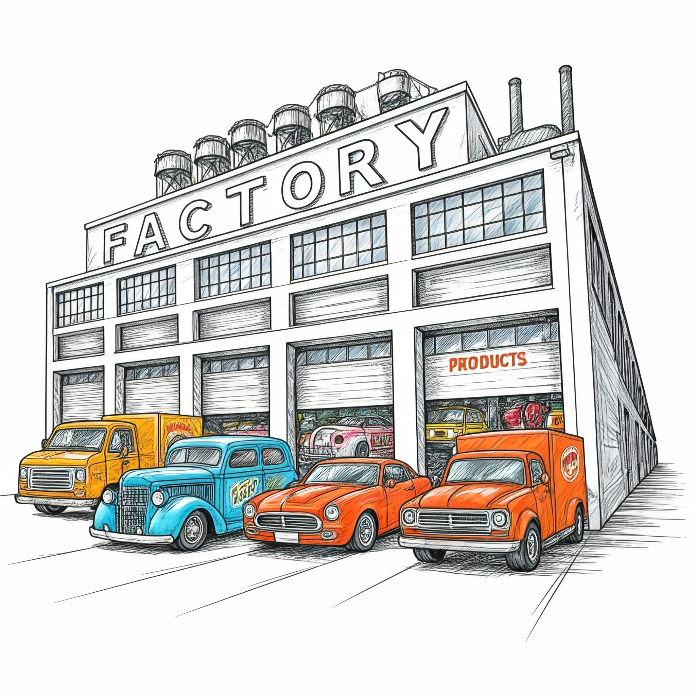
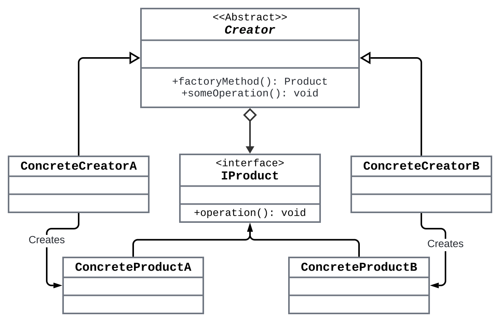

# **Title: The Factory Design Pattern:  Building Objects the Smart Way**

> **Description**: Unveil the magic behind the Factory Design Pattern—learn how to create objects without needing to know the exact class, ensuring flexibility and scalability in your software.

---
Imagine you walk into a coffee shop and order a latte. Instead of making the coffee yourself, you let the barista decide how to make it based on your order. You don’t need to know the intricate details of how the coffee is made, just that you’ll get a cup based on your request. The Factory Pattern works similarly: instead of directly creating objects in your code, you delegate the responsibility to a factory, which knows how to create them based on parameters.

This pattern allows you to **decouple the creation process** from the rest of your business logic, leading to more **flexibility** and **scalability**. You can introduce new types of objects without having to change the code that requests them.

> **Formal Definition**: The Factory Pattern defines an interface for creating objects, but allows subclasses to decide which class to instantiate. This promotes flexibility by removing the direct instantiation of classes and allows for object creation to be handled dynamically based on input conditions.

---

# Why Use the Factory Pattern?

When building a system, we often need to create instances of different classes. Instantiating objects directly can make the code rigid and hard to maintain, especially if new types of objects need to be added in the future. For example, in a UI framework, you may need to create different types of buttons (e.g., WindowsButton, MacButton, WebButton), but you don't want to litter your code with `if-else` or `switch` statements.

Here’s why the Factory pattern is your best friend when creating objects:

1. **Encapsulation**: It hides the details of the object creation, keeping your code clean and organized.
2. **Flexibility**: Want to create new objects without changing your codebase? The Factory allows you to introduce new types of objects without altering existing logic.
3. **Dynamic object creation**: When you need to create objects based on varying input conditions or user actions.
4. **Decoupling code**: When you want to decouple the process of object creation from the client code, making it easier to maintain and extend.

---

# Components of the Factory Design Pattern

The Factory Design Pattern involves several key components:

1. **Product (Abstract Class or Interface)**: Defines the interface of the objects that will be created.
2. **Concrete Products (Subclasses)**: Different implementations of the `Product` interface.
3. **Factory (Interface or Abstract Class)**: Defines a method (often `create()` or `getInstance()`) to return an object.
4. **Concrete Factories**: Subclasses that implement the `Factory` interface, responsible for creating instances of `Concrete Products`.


### Class Diagram




### How the Components Interact

1. **Client Code:**
   - The client code calls `someOperation()` on a `Creator` object.
   - The client doesn't need to know which `ConcreteProduct` is returned.

2. **Creator's `someOperation()`:**
   - Calls the `factoryMethod()` to get a `Product` object.
   - Performs operations using the `Product` object.

3. **Concrete Creator's `factoryMethod()`:**
   - Overrides the abstract `factoryMethod()` in the `Creator` class.
   - Instantiates and returns a `ConcreteProduct`.

4. **Product and Concrete Products:**
   - `ConcreteProductA` and `ConcreteProductB` implement the `Product` interface.
   - Provide concrete implementations of the `operation()` method.
---

# Scenario and Python Implementation

## Example 1: Simplifying Vehicle Creation with the Factory Pattern

Imagine you’re developing software for a vehicle dealership that offers different types of vehicles: **Car**, **Truck**, and **Bike**. Customers can request any of these vehicles, and you need a way to create vehicle instances based on customer input. Directly instantiating vehicle classes throughout the code can lead to tight coupling and duplication, making your system difficult to maintain and extend.

#### Problem
Directly creating vehicles with conditional logic scattered across the codebase results in **tight coupling** and **code duplication**, making the system **difficult to maintain** when introducing new vehicle types or modifying existing ones.

#### Solution
Implement the **Factory Pattern** to centralize vehicle creation. The factory handles the logic of instantiating the appropriate vehicle type, based on input parameters. This keeps the creation logic separate and makes it easy to add new vehicle types in the future.


### Python Code

```python
from abc import ABC, abstractmethod

# Abstract Product
class Vehicle(ABC):
    """Abstract Vehicle class."""
    
    @abstractmethod
    def create(self) -> str:
        pass

# Concrete Products
class Car(Vehicle):
    def create(self) -> str:
        return "Car Created"

class Truck(Vehicle):
    def create(self) -> str:
        return "Truck Created"

class Bike(Vehicle):
    def create(self) -> str:
        return "Bike Created"

# Factory Class
class VehicleFactory:
    @staticmethod
    def get_vehicle(vehicle_type: str) -> Vehicle:
        vehicle_classes = {
            "car": Car,
            "truck": Truck,
            "bike": Bike
        }
        try:
            return vehicle_classes[vehicle_type.lower()]()
        except KeyError:
            raise ValueError(f"Unknown vehicle type: {vehicle_type}")

# Client code
if __name__ == "__main__":
    vehicle = VehicleFactory.get_vehicle('car')
    print(vehicle.create())  # Output: Car Created

    vehicle = VehicleFactory.get_vehicle('truck')
    print(vehicle.create())  # Output: Truck Created
```

### Explanation

- **Vehicle (Abstract Base Class):**
  - Defines the `create` method that all vehicles must implement.
  - Acts as the **Product** interface in the Factory Pattern.

- **Car, Truck, Bike (Concrete Products):**
  - Each class implements the `create` method, returning a message indicating the vehicle's creation.
  - Represents different vehicle types that the dealership offers, such as cars, trucks, and bikes.

- **VehicleFactory (Factory Class):**
  - Contains the static method `get_vehicle`, which takes `vehicle_type` as input.
  - Uses a dictionary to map string values like `"car"`, `"truck"`, and `"bike"` to their respective classes (`Car`, `Truck`, and `Bike`).
  - Instantiates and returns the appropriate vehicle object based on the input.

- **Client Code:**
  - Calls `VehicleFactory.get_vehicle` to obtain vehicle instances without needing to know the details of how they are created.
  - Interacts with the vehicles through the `Vehicle` interface, promoting loose coupling and maintaining flexibility.
  - This approach centralizes object creation, allowing for easy maintenance and scalability by simply modifying or adding to the factory.


### Benefits of This Approach

- **Centralized Creation Logic:**
  - Simplifies maintenance by having all vehicle creation in one place.

- **Loose Coupling:**
  - Client code depends on the abstract `Vehicle` class, not concrete implementations.

- **Easy Scalability:**
  - Adding new vehicle types is straightforward—just create a new class and update the factory.

- **Clean Codebase:**
  - Eliminates repetitive conditional statements, making the code more readable.


## Example 2: Cross-Platform Button Creation

You're building a **cross-platform GUI application** that needs to run on both **Windows** and **macOS**. Since both platforms have their unique look and feel, the application's buttons should match the native style of each platform. Directly instantiating `WindowsButton` or `MacButton` throughout the code will lead to scattered code, making it harder to maintain and extend when adding new platforms or modifying existing ones.

#### **Problem:**
Manually creating buttons for different platforms across the code leads to **tight coupling** and **code duplication**, making the application **hard to maintain and scale**. Additionally, adding support for new platforms requires modifying multiple parts of the code, making it less flexible.

#### **Solution:**
The **Factory Pattern** can help by centralizing the creation of buttons based on the platform. A factory method will handle the logic for creating the appropriate button type, based on the operating system, and return the correct button object. This decouples the client code from the button creation logic, promoting clean and scalable code.


### Python Implementation


```python
from abc import ABC, abstractmethod
import platform

# Abstract Product
class Button(ABC):
    """Abstract Button class defining the render method that all buttons must implement."""
    
    @abstractmethod
    def render(self) -> str:
        """Renders the button."""
        pass


# Concrete Products
class WindowsButton(Button):
    """Button implementation for Windows platform."""
    
    def render(self) -> str:
        """Render a Windows-style button."""
        return "Rendering a Windows-style button."


class MacButton(Button):
    """Button implementation for macOS platform."""
    
    def render(self) -> str:
        """Render a macOS-style button."""
        return "Rendering a macOS-style button."


# Factory Class
class ButtonFactory:
    """Factory class to create platform-specific buttons."""
    
    @staticmethod
    def get_button() -> Button:
        """
        Returns the appropriate button based on the current operating system.
        
        Returns:
            Button: A WindowsButton or MacButton object.
        Raises:
            ValueError: If the operating system is unsupported.
        """
        os_name: str = platform.system()
        if os_name == "Windows":
            return WindowsButton()
        elif os_name == "Darwin":  # macOS is identified as 'Darwin'
            return MacButton()
        else:
            raise ValueError(f"Unsupported OS: {os_name}")


# Client Code
if __name__ == "__main__":
    button: Button = ButtonFactory.get_button()
    print(button.render())  # Output will depend on the current platform
```

### Explanation

- **Button (Abstract Base Class):**
  - Defines the `render` method that all buttons must implement.
  - Acts as the **Product** interface in the Factory Pattern.

- **WindowsButton and MacButton (Concrete Products):**
  - Each class implements the `render` method, returning a message indicating the platform-specific rendering of the button.
  - Represent the different types of buttons required for the **Windows** and **macOS** platforms, ensuring the GUI matches the native style of the OS.

- **ButtonFactory (Factory Class):**
  - Contains the static method `get_button`, which determines the platform using the `platform.system()` function and returns the appropriate button instance (`WindowsButton` or `MacButton`).
  - Centralizes the logic of selecting and creating the correct button type, allowing the client code to remain clean and decoupled from the specifics of button creation.

- **Client Code:**
  - Calls `ButtonFactory.get_button` to obtain the correct platform-specific button object based on the operating system, without worrying about the creation details.
  - The client interacts with the button via the `Button` interface, ensuring loose coupling and flexibility in adding new platforms.
  - This approach keeps the button creation logic in one place, making the system easier to maintain and extend.

---

## Example 3: Simplifying User Creation with the Factory Pattern

Imagine you're building an application that requires different types of users: **Admin**, **Customer**, and **Guest**. Each user type has unique access levels and permissions. Manually instantiating these user classes throughout your code can lead to redundancy and make the system hard to maintain.

### Problem

Directly creating user instances with conditional logic scattered across your codebase causes **tight coupling** and **code duplication**. This approach makes your application **difficult to scale and maintain**, especially when adding new user types or modifying existing ones.

### Solution

Implement the **Factory Design Pattern** to centralize user creation. By delegating the instantiation of user objects to a factory class, your code becomes cleaner, more maintainable, and easier to extend. The factory handles the logic of which user type to create based on input parameters.


### Python Implementation

```python
from abc import ABC, abstractmethod

# Base User class
class User(ABC):
    """Abstract User class with a method to get access level."""
    
    def __init__(self, username: str) -> None:
        self.username = username

    @abstractmethod
    def get_access_level(self) -> str:
        """Return the access level of the user."""
        pass

# Concrete User classes
class Admin(User):
    """Admin user with full access."""
    
    def get_access_level(self) -> str:
        return "Admin: Full Access"

class Customer(User):
    """Customer user with limited access."""
    
    def get_access_level(self) -> str:
        return "Customer: Limited Access"

class Guest(User):
    """Guest user with view-only access."""
    
    def get_access_level(self) -> str:
        return "Guest: View-Only Access"

# Factory class
class UserFactory:
    """Factory to create users based on user type."""
    
    @staticmethod
    def create_user(user_type: str, username: str) -> User:
        """Create a user object based on the user_type."""
        user_classes = {
            "admin": Admin,
            "customer": Customer,
            "guest": Guest
        }
        try:
            return user_classes[user_type.lower()](username)
        except KeyError:
            raise ValueError(f"Unknown user type: {user_type}")

# Usage
if __name__ == "__main__":
    user1 = UserFactory.create_user("admin", "Jamie")
    user2 = UserFactory.create_user("customer", "Alex")

    print(user1.get_access_level())  # Output: Admin: Full Access
    print(user2.get_access_level())  # Output: Customer: Limited Access
```


### Explanation

- **User (Abstract Base Class):**
  - Defines the `get_access_level` method that all user types must implement.
  - Serves as the **Product** interface in the Factory Pattern.

- **Admin, Customer, Guest (Concrete Products):**
  - Each class implements the `get_access_level` method, returning a string that indicates the user's access level.
  - Represents different user types with specific behaviors.

- **UserFactory (Factory Class):**
  - Contains the static method `create_user`, which takes `user_type` and `username` as parameters.
  - Uses a dictionary to map `user_type` strings to the corresponding user classes.
  - Instantiates the appropriate user class based on `user_type`.

- **Client Code:**
  - Calls `UserFactory.create_user` to create user objects without worrying about the instantiation details.
  - Interacts with users through the `User` interface.

---

## Example 4: Managing Notifications with the Factory Pattern

Imagine you're developing an application that sends notifications to users through various channels: **Email**, **SMS**, and **Push Notifications**. Each notification type requires different handling and delivery mechanisms. Hardcoding the creation of these notifications throughout your codebase leads to clutter and reduces flexibility.

### Problem

Instantiating notification types directly causes **code duplication** and **tight coupling**. This approach makes your application **less adaptable** to future changes, such as adding new notification types or modifying existing ones.

### Solution

Apply the **Factory Design Pattern** to centralize the creation of notification objects. The factory class will handle the logic of which notification type to instantiate based on input parameters. This keeps your codebase **clean**, **flexible**, and **easy to maintain**.


### Python Implementation

```python
from abc import ABC, abstractmethod

# Notification Interface
class Notification(ABC):
    """Abstract Notification class with a method to send messages."""
    
    @abstractmethod
    def send(self, message: str) -> None:
        """Send a notification with the given message."""
        pass

# Concrete Notification classes
class EmailNotification(Notification):
    """Email notification implementation."""
    
    def send(self, message: str) -> None:
        print(f"Sending Email: {message}")

class SMSNotification(Notification):
    """SMS notification implementation."""
    
    def send(self, message: str) -> None:
        print(f"Sending SMS: {message}")

class PushNotification(Notification):
    """Push notification implementation."""
    
    def send(self, message: str) -> None:
        print(f"Sending Push Notification: {message}")

# Factory class
class NotificationFactory:
    """Factory to create notifications based on type."""
    
    @staticmethod
    def create_notification(notification_type: str) -> Notification:
        """Create a notification object based on the notification_type."""
        notification_classes = {
            "email": EmailNotification,
            "sms": SMSNotification,
            "push": PushNotification
        }
        try:
            return notification_classes[notification_type.lower()]()
        except KeyError:
            raise ValueError(f"Unknown notification type: {notification_type}")

# Usage
if __name__ == "__main__":
    notifier = NotificationFactory.create_notification("email")
    notifier.send("Your order has been shipped!")  # Output: Sending Email: Your order has been shipped!

    notifier = NotificationFactory.create_notification("push")
    notifier.send("You have a new message!")  # Output: Sending Push Notification: You have a new message!
```


### Explanation

- **Notification (Abstract Base Class):**
  - Defines the `send` method that all notification types must implement.
  - Acts as the **Product** interface in the Factory Pattern.

- **EmailNotification, SMSNotification, PushNotification (Concrete Products):**
  - Each class implements the `send` method with specific logic for sending the notification via the respective channel.

- **NotificationFactory (Factory Class):**
  - Contains the static method `create_notification`, which takes `notification_type` as a parameter.
  - Uses a dictionary to map `notification_type` strings to the corresponding notification classes.
  - Instantiates the appropriate notification class based on `notification_type`.

- **Client Code:**
  - Calls `NotificationFactory.create_notification` to obtain notification objects without dealing with their instantiation.
  - Uses the `send` method to send messages.

---

> In Python, the Factory Pattern is implemented by using static methods to create instances. For more complex systems, you may implement an **Abstract Factory** to manage families of related objects, but the fundamental principle remains the same: centralize and abstract object creation.


# When to Use the Factory Pattern

- **You need flexibility**: The Factory lets you decouple the client code from the actual object creation process, keeping things neat and scalable.
- **Object creation logic is growing**: When your codebase is filled with `if-else` conditions for creating objects, it’s time to use the Factory Pattern.
- **Introducing new object types**: The Factory Pattern simplifies adding new objects without affecting existing code.

---

# Anti-Patterns & Pitfalls: Don’t Over-Engineer with Factory

While factories are excellent for handling complex creation logic, they can become cumbersome in simple scenarios. If you only have one or two object types with minimal complexity, introducing a factory might actually make your code more difficult to understand, as it adds an unnecessary layer of abstraction. For example, if you only have one type of notification in your app, a factory is overkill—direct instantiation would suffice.

---

# Conclusion: Factory in a Nutshell

The Factory Design Pattern is an invaluable tool for creating objects in a flexible, scalable, and maintainable way. By delegating object creation to a factory, you promote loose coupling and simplify your codebase, making it easier to extend and maintain.
