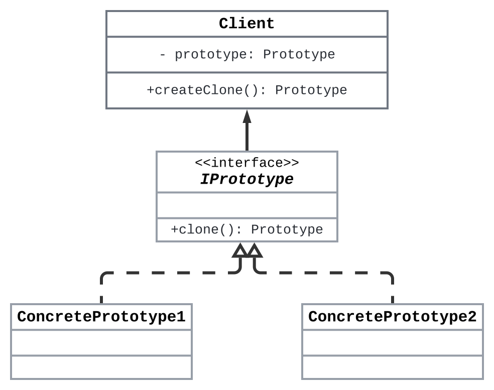

# **Title: The Prototype Design Pattern: Cloning Objects the Smart Way**

> **Description**: Explore the art of object cloning with the Prototype Design Pattern—learn how to create objects based on existing instances, improving performance and flexibility when building complex systems.

---

Imagine you’re a sculptor creating an intricate statue. Once it’s done, a client requests 10 more identical statues. Instead of starting from scratch each time, wouldn’t it be easier to create duplicates of the original? That’s exactly what the **Prototype Design Pattern** offers: a way to **clone existing objects**, ensuring you get a duplicate without re-instantiating everything from scratch.

> **Formal Definition**: The **Prototype Pattern** is a creational design pattern in which new objects are created by copying an existing object, known as the prototype, instead of instantiating a new object from scratch.

This pattern is particularly useful when object creation is **resource-intensive** (e.g., when building complex objects or fetching data from databases) or when there are only a few different configurations for objects, and you need many instances of them.

---

# Why Use the Prototype Pattern?

In software development, we often create objects with complex configurations that can be **time-consuming** and **expensive** to instantiate. This is where the Prototype Pattern shines. Instead of repeatedly creating instances from scratch, you clone a pre-configured object. Here’s why the Prototype Pattern can elevate your object creation game:

1. **Performance Optimization**: Cloning existing objects is faster than creating new ones, especially when the object creation involves significant resources (e.g., database calls or complex algorithms).
2. **Simplifies Complex Object Creation**: When dealing with complex objects that involve multiple steps for creation, the Prototype Pattern lets you duplicate the object without going through the entire process again.
3. **Decoupling from Concrete Classes**: By cloning prototypes, you avoid coupling to concrete classes, leading to more flexible and maintainable code.
4. **Customizable Cloning**: Objects can define how they are cloned, offering flexibility in how their state is copied (deep copy vs. shallow copy).

---

# Components of the Prototype Design Pattern

The Prototype Design Pattern involves several key components:

1. **Prototype (Interface or Abstract Class)**: Declares a method to clone itself. This method is responsible for returning a copy of the object.
2. **Concrete Prototypes (Subclasses)**: Specific classes that implement the `clone()` method and define how objects of this type should be copied.
3. **Client**: The client that needs a copy of the object calls the `clone()` method instead of creating a new instance using a constructor.

### Class Diagram



---

# How the Components Interact

1. **Client Code:**
   - The client calls the `clone()` method on a prototype object to create a copy of it.
   - The client doesn’t need to know the specific class of the prototype; it only interacts with the `Prototype` interface.

2. **Prototype’s `clone()` Method:**
   - This method defines how an object should be cloned. It can either perform a **shallow copy** (copying only the references to other objects) or a **deep copy** (copying the actual objects as well).
   - The `clone()` method returns a new instance of the object, which is a copy of the prototype.

3. **Concrete Prototypes:**
   - Each concrete class implements the `clone()` method, determining how a particular object should be copied. 
   - For instance, if an object contains nested objects or complex data structures, the `clone()` method can be customized to handle deep copying.

4. **Object Creation via Cloning:**
   - Instead of calling a constructor to instantiate a new object, the client calls the `clone()` method, which returns a new object based on the prototype's current state.

---

# **Scenario and Python Implementation**

## **Example 1: Game Character Cloning**

Imagine you’re developing a **game** where multiple instances of similar characters are required, such as soldiers or enemies. Each character has a complex set of attributes and skills that take significant time to initialize. Instead of creating each character from scratch, you want a way to clone an existing character with its current state, allowing you to generate new instances quickly and efficiently.

### **Problem**

Creating new characters from scratch every time can be **resource-intensive** and **time-consuming**, especially when initializing complex attributes. You need a way to quickly generate new characters with the same attributes as existing ones but allow modifications to certain properties if needed.

### **Solution**

The **Prototype Design Pattern** allows you to clone existing objects and customize them as needed. Instead of constructing a character from scratch, the client can request a clone of an existing character (prototype). This reduces the overhead of re-creating complex objects and allows new instances to be generated efficiently.

---

### **Python Code**

```python
from abc import ABC, abstractmethod
import copy

# Step 1: Prototype Interface
class Prototype(ABC):
    """Abstract base class for cloning objects."""
    
    @abstractmethod
    def clone(self):
        """Method to clone the object."""
        pass

# Step 2: Concrete Prototype
class GameCharacter(Prototype):
    """Concrete prototype representing a game character."""
    
    def __init__(self, name: str, health: int, skills: list):
        self.name = name
        self.health = health
        self.skills = skills

    def clone(self):
        """Performs deep copy to ensure full duplication of the object."""
        return copy.deepcopy(self)

    def __str__(self):
        return f"Character: {self.name}, Health: {self.health}, Skills: {self.skills}"

# Step 3: Client code
if __name__ == "__main__":
    # Create an original character prototype
    original_character = GameCharacter("Warrior", 100, ["Swordsmanship", "Defense"])

    # Clone the character
    cloned_character = original_character.clone()
    
    # Modify the cloned character's attributes
    cloned_character.name = "Knight"
    cloned_character.skills.append("Shield Mastery")

    # Display original and cloned characters
    print(original_character)  # Output: Character: Warrior, Health: 100, Skills: ['Swordsmanship', 'Defense']
    print(cloned_character)    # Output: Character: Knight, Health: 100, Skills: ['Swordsmanship', 'Defense', 'Shield Mastery']
```

---

### **Explanation**

- **Prototype (Abstract Base Class):**
  - Declares the `clone()` method that all concrete prototypes must implement. This method defines how objects will be copied (either shallow or deep copy).
  - Acts as the base class for all prototypes in the system, providing a way for clients to clone objects.

- **GameCharacter (Concrete Prototype):**
  - Implements the `clone()` method using deep copying, ensuring that both the original and cloned objects are independent.
  - Represents a character in the game with attributes like `name`, `health`, and `skills`.
  - The `clone()` method ensures that the skills list is copied as a new object, preventing shared references between the original and the clone.

- **Client Code:**
  - Uses the `clone()` method on an existing `GameCharacter` to create a new instance with the same attributes.
  - After cloning, the client can modify the clone’s attributes, showing that the cloned object is independent of the original.
---
> ### Prototype Design Pattern in Python: Tips
> - Python’s built-in `copy` module provides both **shallow** (`copy.copy()`) and **deep copying** (`copy.deepcopy()`). Use `deepcopy()` when you need to clone nested objects, like lists or dictionaries, to avoid shared references between the original and the clone.
> - The core of the Prototype Pattern is the `clone()` method. This method should return a copy of the object. You can use either a shallow or deep copy based on your use case.
> - Ensure that your classes inherit from a **prototype interface** or **abstract base class** that declares the `clone()` method. This helps standardize cloning behavior across different types of objects.
> - Once an object is cloned, it’s independent of the original, meaning you can freely modify the clone without affecting the original.
---
## **Example 2: Document Cloning in a Word Processor**

Imagine you’re developing a **word processor** like Microsoft Word or Google Docs. Users often work with **templates**—documents pre-configured with specific styles, fonts, and layouts. Instead of creating a new document from scratch each time, you want to provide users the ability to quickly create a new document by **cloning** an existing template, allowing them to modify content without altering the original format.

### **Problem**

Manually creating new documents every time is tedious and inefficient, especially when the document requires specific styles or formats. You need a way to **quickly create new documents** by copying an existing template and then allowing the user to modify the content without affecting the original.

### **Solution**

The **Prototype Design Pattern** allows you to create new documents by cloning an existing document (prototype) and then modifying the cloned version as needed. This approach ensures that users can quickly generate new documents based on pre-configured templates, reducing the need for repetitive formatting and setup.

---

### **Python Code**

```python
from abc import ABC, abstractmethod
import copy

# Step 1: Prototype Interface
class DocumentPrototype(ABC):
    """Abstract base class for cloning documents."""
    
    @abstractmethod
    def clone(self):
        pass

# Step 2: Concrete Prototype
class Document(DocumentPrototype):
    """Concrete prototype representing a document."""
    
    def __init__(self, title: str, content: str, styles: dict):
        self.title = title
        self.content = content
        self.styles = styles

    def clone(self):
        """Perform deep copy to ensure that all attributes, including styles, are duplicated."""
        return copy.deepcopy(self)

    def __str__(self):
        return f"Title: {self.title}\nContent: {self.content}\nStyles: {self.styles}"

# Step 3: Client Code
if __name__ == "__main__":
    # Create an original document template
    template_document = Document("Template", "This is a template document.", {"font": "Arial", "size": 12})

    # Clone the document
    cloned_document = template_document.clone()
    
    # Modify the cloned document
    cloned_document.title = "My New Document"
    cloned_document.content = "This is a new document based on the template."
    cloned_document.styles["size"] = 14

    # Display original and cloned documents
    print(template_document)  # Shows the original template
    print(cloned_document)    # Shows the new document with modified content and styles
```

---

### **Explanation**

- **DocumentPrototype (Abstract Base Class)**:
  - Declares the `clone()` method, which defines how the document should be copied.
  - Represents the prototype interface for documents, ensuring that any document can be cloned.

- **Document (Concrete Prototype)**:
  - Implements the `clone()` method using deep copying to ensure that both the document’s content and its styles are fully duplicated.
  - The document contains attributes like `title`, `content`, and `styles`, all of which are copied when the `clone()` method is called.

- **Client Code**:
  - Uses the `clone()` method to create a new document based on a pre-configured template.
  - The client can modify the cloned document’s attributes, such as its title, content, or styles, without affecting the original template.

---

## **Example 3: Shape Cloning in a Drawing Application**

Imagine you’re building a **drawing application** like Adobe Illustrator or Figma. Users often create multiple instances of shapes, such as circles, squares, or polygons, all with the same properties like color, size, or border thickness. Instead of creating each shape from scratch, users should be able to **clone existing shapes** and adjust their properties.

### **Problem**

Creating new shapes with the same properties repeatedly can be time-consuming. You need a way to efficiently create **duplicate shapes** with the same properties, allowing users to adjust specific attributes like size or color as needed.

### **Solution**

The **Prototype Design Pattern** allows you to create new shapes by cloning an existing shape (prototype) and modifying the copy’s attributes. This reduces the need for repeated creation of identical shapes, improving user productivity and performance in the drawing application.

---

### **Python Code**

```python
from abc import ABC, abstractmethod
import copy

# Step 1: Prototype Interface
class ShapePrototype(ABC):
    """Abstract base class for cloning shapes."""
    
    @abstractmethod
    def clone(self):
        pass

# Step 2: Concrete Prototypes for different shapes
class Circle(ShapePrototype):
    """Concrete prototype for a Circle shape."""
    
    def __init__(self, radius: int, color: str, border_thickness: int):
        self.radius = radius
        self.color = color
        self.border_thickness = border_thickness

    def clone(self):
        """Performs deep copy to clone the circle."""
        return copy.deepcopy(self)

    def __str__(self):
        return f"Circle with radius {self.radius}, color {self.color}, and border thickness {self.border_thickness}"

class Square(ShapePrototype):
    """Concrete prototype for a Square shape."""
    
    def __init__(self, side_length: int, color: str, border_thickness: int):
        self.side_length = side_length
        self.color = color
        self.border_thickness = border_thickness

    def clone(self):
        """Performs deep copy to clone the square."""
        return copy.deepcopy(self)

    def __str__(self):
        return f"Square with side length {self.side_length}, color {self.color}, and border thickness {self.border_thickness}"

# Step 3: Client code
if __name__ == "__main__":
    # Create original shape prototypes
    original_circle = Circle(10, "red", 2)
    original_square = Square(5, "blue", 1)

    # Clone the shapes
    cloned_circle = original_circle.clone()
    cloned_square = original_square.clone()
    
    # Modify the cloned shapes' properties
    cloned_circle.radius = 15
    cloned_circle.color = "green"
    
    cloned_square.side_length = 8
    cloned_square.border_thickness = 3

    # Display original and cloned shapes
    print(original_circle)  # Output: Circle with radius 10, color red, and border thickness 2
    print(cloned_circle)    # Output: Circle with radius 15, color green, and border thickness 2

    print(original_square)  # Output: Square with side length 5, color blue, and border thickness 1
    print(cloned_square)    # Output: Square with side length 8, color blue, and border thickness 3
```

---

### **Explanation**

- **ShapePrototype (Abstract Base Class)**:
  - Declares the `clone()` method for cloning shape objects.
  - Provides a common interface for all shape prototypes, such as `Circle` and `Square`.

- **Circle and Square (Concrete Prototypes)**:
  - Implement the `clone()` method using deep copying, ensuring that each shape is duplicated with its current properties.
  - The `Circle` class has properties like `radius`, `color`, and `border_thickness`, while `Square` has `side_length`, `color`, and `border_thickness`.

- **Client Code**:
  - Uses the `clone()` method to create new instances of shapes (e.g., `Circle`, `Square`) based on existing prototypes.
  - After cloning, the client can modify the cloned shape’s properties (e.g., increasing the size or changing the color) without affecting the original shape.


---

# When to Use the Prototype Pattern?

The Prototype Pattern is useful when:

1. **Creating Complex Objects**: When object creation involves several expensive steps (e.g., loading data from a database), cloning an object can be far more efficient than building it from scratch.
2. **Reducing Class Hierarchies**: Instead of using multiple subclasses to model different object configurations, you can create one prototype and clone it, adjusting its attributes as needed.
3. **Avoiding Re-initialization**: When you have objects that are already initialized, cloning them can avoid the overhead of re-initializing and reconfiguring the object.

---

# Prototype vs. Factory Patterns: What's the Difference?

While both **Prototype** and **Factory Patterns** deal with object creation, their approach is quite different:

- **Factory Pattern**: Focuses on creating new objects by instantiating classes (often through a factory). It decouples the creation process from the client code but still requires creating a new object from scratch.
  - Example: A factory creating a brand new instance of a **button** or **vehicle**.

- **Prototype Pattern**: Focuses on creating new objects by **cloning** existing ones, allowing for fast duplication without the overhead of re-instantiating the object from scratch.
  - Example: Cloning a pre-configured **game character** or **UI component**.

> **Key Takeaway**: Use the Prototype Pattern when cloning objects is more efficient than creating new ones from scratch, especially when dealing with resource-intensive or complex objects.

---

---

### **Advantages of the Prototype Pattern**

1. **Efficient Object Creation**: Cloning existing objects is often faster and more efficient than instantiating new ones, especially for complex objects.
  
2. **Simplifies Object Initialization**: Reduces the need to repeatedly initialize objects from scratch. You can configure a prototype once and clone it multiple times.

3. **Encourages Decoupling**: By cloning prototypes instead of instantiating concrete classes, you reduce coupling between object creation and the client code, promoting flexibility and scalability.

4. **Reduces Subclassing**: Instead of creating multiple subclasses to represent variations of an object, you can use a prototype and modify the cloned instances as needed.

---

### **Antipatterns and Pitfalls**

1. **Shared Mutable State**: When using shallow copies, cloned objects may still share references to mutable fields (like lists or dictionaries) with the original object. This can lead to unintended side effects if the state of the original is changed. Always use deep copying (`copy.deepcopy()`) if necessary.

2. **Overuse in Simple Scenarios**: The Prototype Pattern is most effective for complex or resource-heavy object creation. Using it for simple objects where instantiation is cheap can add unnecessary complexity to your code.

3. **Managing Copy Behavior**: Cloning objects with complex relationships or external dependencies (e.g., file handles or network connections) can be tricky, as these resources often need special handling. Be cautious when copying such objects.

4. **Memory Consumption**: If you clone a large number of objects, each clone will consume memory. Be mindful of memory usage, especially when cloning large or complex objects.

---

### **Conclusion**

The **Prototype Design Pattern** is a powerful tool for efficiently creating complex or resource-intensive objects. By cloning existing objects rather than creating them from scratch, you can optimize performance, simplify object initialization, and maintain flexibility in your codebase. However, it’s essential to handle cloning correctly—especially when dealing with mutable objects and deep copies—to avoid potential pitfalls. Use the Prototype Pattern wisely in scenarios where performance and object complexity are key concerns, and enjoy the benefits of efficient and flexible object creation!
