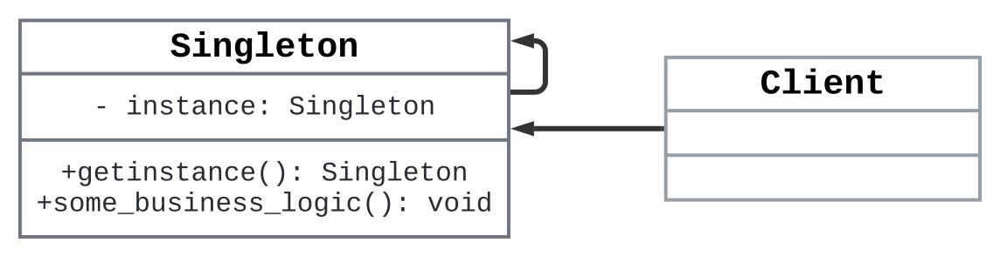

# Title: The Singleton Design Pattern: Why One is Better Than Many

> Description: Discover how the Singleton Design Pattern can streamline your software by ensuring that only one instance of a class exists, saving resources and preventing chaos.

Have you ever wondered why some parts of your application—like the database connection, the logging service, or the configuration manager—just need to be shared across the whole system? Imagine if every time you logged an error, a new logger was created—chaos, right?

Well, that’s exactly the problem the **Singleton Design Pattern** solves. It ensures that only **one instance** of a class is created throughout the application and provides a **global point of access** to it. Whether it's managing a pool of connections or maintaining a configuration manager, Singleton can save your system from spiraling into resource madness.

## Key Features of Singleton (And Why You Should Care)

Here’s the simple beauty of the Singleton pattern:

1. **Single Instance**: It guarantees there’s only one object, no matter how many times you try to create it.
2. **Global Access**: This one instance is available anywhere in your codebase, ensuring consistency.
3. **Lazy Initialization**: The instance is only created when needed. _(Think of it like brewing coffee only when someone asks for it—not when you don’t know if anyone's thirsty.)_


## When Singleton is Your Friend (and When It’s Not)

Singleton is a great solution in certain situations. Here are some common use cases:

- **Database Connections**: You don’t want to open a new connection every time your app needs to talk to the database. Instead, you share a single connection throughout the app, avoiding performance hits.

- **Logging**: Consistent logging is crucial for debugging, and Singleton ensures there’s only one logger writing to the file, preventing logging mishaps.

- **Configuration Manager**: Imagine every part of your app has its own version of your config settings—utter chaos. With Singleton, you ensure only one configuration manager exists.

But here's the flip side: **overusing Singletons** can cause more harm than good. They're not always the hero you need. Here’s why:


# Key Components of the Singleton Design Pattern

1. **Singleton Class**:
   - **Private Instance (`_instance`)**: This is a private static member of the class that stores the single instance of the class. It ensures that only one instance of the Singleton class is created and accessed.
   - **Public `get_instance()` Method**: This is a static method that provides access to the Singleton instance. It checks if the instance exists, and if not, it creates the instance. The same instance is returned on subsequent calls.
   - **Business Logic (`some_business_logic()`)**: This is a method that contains the core functionality of the Singleton class. It performs some action using the Singleton instance.

2. **Client Class**:
   - The `Client` class is any class or code that interacts with the Singleton. It does not create the Singleton instance directly but calls `Singleton.get_instance()` to access the single instance and invoke business logic.
   
3. **Self-loop in Singleton**:
   - The self-loop in the class diagram represents the Singleton’s ability to return itself. The `get_instance()` method returns the Singleton instance itself, ensuring the same instance is reused.

## Class Diagram


### How the Components Interact

1. **Singleton Instance**:
   - The `Singleton` class has a **private static member** `_instance` that holds the single instance of the class.
   - The **`get_instance()`** method checks if the `_instance` is `None` (i.e., not created yet). If so, it creates the instance and returns it. Otherwise, it just returns the existing instance.

2. **Business Logic**:
   - The `Singleton` class may contain business logic that can be accessed via the singleton instance. This logic can be implemented in a method like **`some_business_logic()`**.

3. **Client Interaction**:
   - The `Client` class or any other client code doesn’t directly instantiate the `Singleton`. Instead, it calls the **`get_instance()`** method of the `Singleton` to get the instance and then invoke its methods.
   - The client does not need to worry about how the instance is created or managed; it simply interacts with the Singleton via the **public `get_instance()` method** and uses it to perform some action through `some_business_logic()`.

4. **Self-loop of Singleton**:
   - The **self-loop** represents the fact that the `get_instance()` method of the `Singleton` class returns the instance of the Singleton class itself, ensuring that the same instance is always used.


## Scenario and Python Implementation:
### Example 1: Simple Singleton in Python
In most applications, managing database connections is critical. Creating a new connection every time a query is executed would be inefficient and resource-intensive. The **Singleton pattern** ensures that only one instance of a **DatabaseConnection** is created and shared across the application.

#### **Python Code:**

```python
class DatabaseConnection:
    _instance: 'DatabaseConnection' = None

    def __new__(cls) -> 'DatabaseConnection':
        """
        Create a new instance of DatabaseConnection if it doesn't exist.
        Otherwise, return the existing instance.
        """
        if cls._instance is None:
            print("Creating the database connection instance")
            cls._instance = super(DatabaseConnection, cls).__new__(cls)
            cls._connection = cls.connect_to_database()
        return cls._instance

    @staticmethod
    def connect_to_database() -> str:
        """
        Simulate connecting to a database.
        """
        return "Database Connection Established"

    def execute_query(self, query: str) -> None:
        """
        Execute a database query.
        """
        print(f"Executing query: {query}")

# Usage
db1 = DatabaseConnection()
db2 = DatabaseConnection()

db1.execute_query("SELECT * FROM users")
db2.execute_query("SELECT * FROM orders")

# Check if both db1 and db2 are the same instance
print(db1 is db2)  # Output: True (both are the same connection instance)
```

#### Explanation:
- The `__new__` method is overridden to check if an instance already exists.
- If `_instance` is `None`, a new instance is created; otherwise, the existing instance is returned.
- The result is that both `db1` and `db2` refer to the same instance.


> ### Backstage: How `__new__` Works
> **Sequence of Function Calling:**
> 1. **`__new__` is called first:**
>      - The **`__new__`** method is responsible for **creating a new instance of the class**. It is a static method and is called when an instance is being created.
>    - This method is called first, even before the `__init__` method, and it returns a new instance of the class.
> 2. **`__init__` is called after `__new__`:**
>    - Once the instance is created and returned by `__new__`, the **`__init__`** method is called to initialize the instance. This is where you typically set up attributes or perform initialization tasks.
<paragraph font-size=small, color=gray>**Note:** The `__new__` method is used in the Singleton pattern to control the creation of instances and ensure that only one instance is created.</paragraph>
---

### Example 2: Singleton Using a Decorator for Logger

Logging is a vital aspect of applications, and you generally want only **one logger instance** to maintain consistent logging throughout the application. The **Singleton pattern** ensures that there's one shared logger across all modules, avoiding redundant loggers and possible resource overhead.

#### **Python Code:**

```python
from typing import Type, Dict, Any

def singleton(cls: Type) -> Type:
    """
    Decorator to create a singleton instance of a class.
    """
    instances: Dict[Type, Any] = {}
    
    def get_instance(*args: Any, **kwargs: Any) -> Any:
        """
        Get the instance of the singleton class.
        """
        if cls not in instances:
            instances[cls] = cls(*args, **kwargs)
        return instances[cls]
    
    return get_instance

@singleton
class Logger:
    def __init__(self) -> None:
        """
        Initialize the Logger instance.
        """
        print("Logger instance created")
        self.log_file: str = "app.log"

    def log(self, message: str) -> None:
        """
        Log a message to the log file.
        
        Args:
            message (str): The message to log.
        """
        with open(self.log_file, "a") as f:
            f.write(message + "\n")

# Usage
logger1 = Logger()
logger2 = Logger()

logger1.log("Logger 1: Starting application...")
logger2.log("Logger 2: Performing operations...")

# Check if both logger1 and logger2 are the same instance
print(logger1 is logger2)  # Output: True (both loggers are the same instance)
```

#### Explanation:
- The `singleton` decorator checks if an instance of the class already exists in the `instances` dictionary.
- If it doesn't exist, it creates one and stores it.
- Every subsequent call to the class will return the existing instance, ensuring the singleton pattern.

---

### Example 3 (Advanced): Thread-Safe Singleton for Configuration Manager

In large applications, a **Configuration Manager** is often used to manage system-wide settings (like database credentials, file paths, or API keys). A **Singleton pattern** ensures that only one instance of the configuration manager exists, and in multi-threaded environments, it's important that this instance is thread-safe to avoid race conditions.

#### **Python Code:**

```python
import threading
from typing import Dict, Any

class ConfigurationManager:
    _instance: 'ConfigurationManager' = None
    _lock: threading.Lock = threading.Lock()

    def __new__(cls) -> 'ConfigurationManager':
        """
        Create a new instance of ConfigurationManager if it doesn't exist.
        Ensure thread-safety using double-checked locking.
        """
        if cls._instance is None:
            with cls._lock:  # Ensure thread-safety
                if cls._instance is None:  # Double-checked locking
                    print("Creating Configuration Manager instance")
                    cls._instance = super(ConfigurationManager, cls).__new__(cls)
                    cls._settings = cls.load_configuration()
        return cls._instance

    @staticmethod
    def load_configuration() -> Dict[str, Any]:
        """
        Load the configuration settings.
        """
        return {
            "database": "Postgres",
            "log_level": "DEBUG",
            "api_key": "1234567890abcdef"
        }

    def get_setting(self, key: str) -> Any:
        """
        Get a configuration setting by key.
        """
        return self._settings.get(key)

# Usage
def fetch_config() -> None:
    """
    Fetch and print the database configuration setting.
    """
    config = ConfigurationManager()
    print(config.get_setting("database"))

# Simulate multi-threaded environment
thread1 = threading.Thread(target=fetch_config)
thread2 = threading.Thread(target=fetch_config)

thread1.start()
thread2.start()

thread1.join()
thread2.join()

# Check if both instances are the same
print(ConfigurationManager() is ConfigurationManager())  # Output: True
```

#### Explanation:
- A class-level lock (`_lock`) is used to ensure that only one thread can enter the critical section where the instance is created.
- The **double-checked locking** ensures that the instance is not created more than once, even if multiple threads attempt to access it at the same time.

---

### Example 4 (Advanced): Singleton with a Metaclass for Resource Pooling (Connection Pool)

In high-traffic applications, **connection pooling** is often used to manage a pool of reusable connections (such as database connections or HTTP connections) instead of creating new ones every time. The **Singleton pattern** ensures there’s only one **ResourcePool** managing these connections.

#### **Python Code:**

```python
from typing import Any, Dict, List

class SingletonMeta(type):
    _instances: Dict[type, Any] = {}

    def __call__(cls, *args: Any, **kwargs: Any) -> Any:
        """
        Create a new instance of the class if it doesn't exist.
        Otherwise, return the existing instance.
        Returns:
            Any: The singleton instance of the class.
        """
        if cls not in cls._instances:
            cls._instances[cls] = super(SingletonMeta, cls).__call__(*args, **kwargs)
        return cls._instances[cls]

class ResourcePool(metaclass=SingletonMeta):
    def __init__(self) -> None:
        """
        Initialize the ResourcePool instance.
        """
        print("Creating a Resource Pool instance")
        self.connections: List[str] = ["Connection 1", "Connection 2", "Connection 3"]

    def get_connection(self) -> str:
        """
        Get a connection from the pool.
        """
        if self.connections:
            return self.connections.pop(0)
        else:
            return "No available connections"

    def return_connection(self, connection: str) -> None:
        """
        Return a connection to the pool.
        """
        self.connections.append(connection)

# Usage
pool1 = ResourcePool()
pool2 = ResourcePool()

print(pool1.get_connection())  # Output: Connection 1
print(pool2.get_connection())  # Output: Connection 2

pool1.return_connection("Connection 4")
print(pool2.get_connection())  # Output: Connection 4

# Check if both pool1 and pool2 are the same instance
print(pool1 is pool2)  # Output: True (both refer to the same pool instance)
```


#### Explanation:
- The metaclass `SingletonMeta` controls the creation of instances.
- The `__call__` method is overridden to return the same instance if it already exists in the `_instances` dictionary.
- This approach separates the singleton logic from the class itself by using the power of metaclasses.

---

## When to Use:
- **Resource Management**: When managing resources like connections or threads where having multiple instances would be costly.
- **Global Configuration**: When application-wide configurations need to be accessed by different parts of the application.
- **Logging**: When you want to ensure that logging throughout the application is centralized and consistent.

However, be careful not to overuse singletons, as they can make unit testing more difficult and may introduce hidden dependencies if not carefully managed.

---
## Anti-Patterns & Pitfalls: Don't Go Singleton-Crazy

Here’s a common mistake: some developers, excited by the power of Singleton, start making everything a Singleton. Don’t fall into that trap! Just because it's easy to implement doesn’t mean it's the right tool for every job.

### The Anti-Pattern Warning:
Singletons introduce **global state**, which can become a **nightmare for debugging** and **unit testing**. If too many parts of your app rely on Singletons, tracking down why something isn't working as expected can turn into a game of hide-and-seek. Worse, if one part of the system modifies the Singleton’s state unexpectedly, it might lead to unpredictable behavior elsewhere.

### Common Pitfalls:
- **Hard to Test**: Singletons can make unit testing difficult because they introduce global state. You can’t easily isolate them for tests.
- **Hidden Dependencies**: By introducing a global instance, you can accidentally create hidden couplings between different parts of your code. This can make it harder to track down bugs and maintain the system.

---
## Conclusion: Singleton in a Nutshell

To sum it all up: Singleton is a powerful pattern when used wisely. It gives you control over shared resources and simplifies management, but it's not a one-size-fits-all solution. Use it when:

- You need a **shared resource** (like a database connection).
- You want to **ensure consistency** (like logging).
- You need to **limit the number of instances** (like a configuration manager).

But remember—don't overdo it. The hidden dependencies, testing challenges, and potential for hard-to-track bugs mean Singletons should be used thoughtfully.